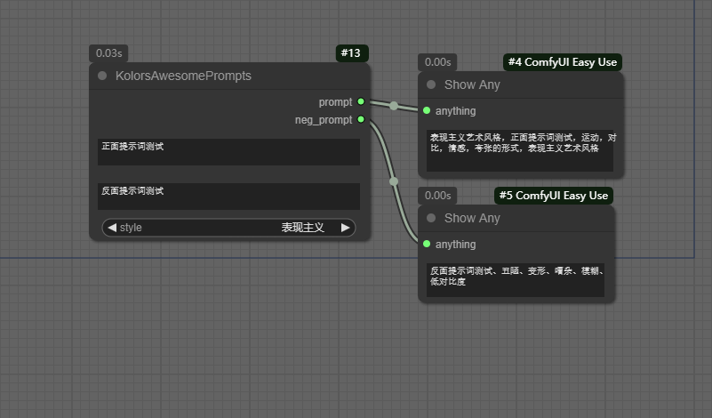

# Kolors Awesome Prompts

## 用于便捷化的选择画面风格

显示文本的节点是
[ComfyUI-Easy-Use](https://github.com/yolain/ComfyUI-Easy-Use)

## 数据来源

本项目使用的数据集来源于 [ModelScope](https://modelscope.cn/) 平台上的 [Kolors Awesome Prompts](https://modelscope.cn/datasets/modelscope/Kolors_awesome_prompts) 数据集。

## 数据集介绍

- **名称**: Kolors Awesome Prompts
- **来源**: ModelScope 数据集平台
- **链接**: [Kolors Awesome Prompts](https://modelscope.cn/datasets/modelscope/Kolors_awesome_prompts)

### 数据集内容

该数据集包含了多种风格的提示语和负向提示语，可用于生成多样化的文本内容。

## 感谢

在此特别感谢 [ModelScope](https://modelscope.cn/) 提供的 [Kolors Awesome Prompts](https://modelscope.cn/datasets/modelscope/Kolors_awesome_prompts) 数据集